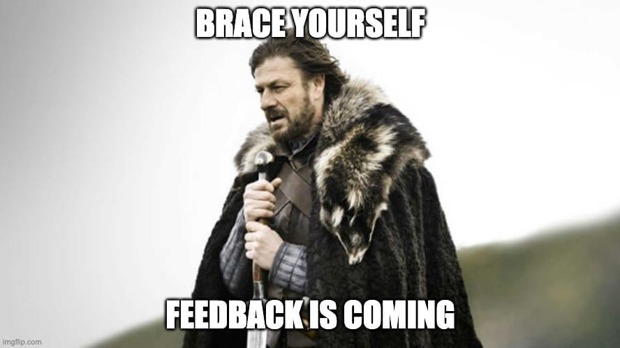

# Pesquisa

Bem, por onde começar?

Acredito que uma pesquisa superficial sobre os principais conceitos é essencial para adquirir um breve conhecimento sobre o que se está pesquisando.

## Sites pesquisados
### Primeiro site
O primeiro site pesquisado foi o [Aevo](https://blog.aevo.com.br/ferramentas-de-feedback/), post de 2022. Uma rápida leitura retornou alguns conceitos iniciais como Melhoria Contínua (Kaizen) e tipos de _feedback_ (positivos, negativos, construtivos ou pessoais). Mais para o final foram listadas quatro ferramentas:

- Avaliação de desempenho
    - Mensurar a produtividade, eficiência e identificar talentos
    - Ajuda no planejamento relativo ao capital humano da empresa
    - Hard e soft skills passam por uma análise cuidadosa
- Feedback 360
    - Método de pesquisa devolutiva
    - Coleta anônima de _feedback_ dos colaboradores sobre companheiros
    - Ferramenta ideal para conseguir uma profundidade maior na pesquisa
- Feedback Canvas
    - Proposta voltada para o contexto coletivo
    - Reunir o time no mesmo ambiente para obter devolutivas
    - Ressalta a importância da performance de todo o time nos resultados
    - É necessário definir datas para que toda a equipe participe
    - Determina prazos para que as melhorias apontadas sejam realizadas
    
- Feedforward
    - Focar em ações futuras
    - Soluções orientadas para o futuro
    - Necessário pesquisar mais para entender o modelo

### Segundo Site
O segundo site pesquisado foi o [Engage](https://engage.bz/blog/ferramentas-de-feedback-que-todo-gestor-precisa-conhecer/), post de 2019. Ele já inicia dizendo que dar _feedback_ deve ser uma cultura dentro dos ambientes. Também cita melhoria contínua e lista diversos benefícios trazidos pela prática:
- Reconhecimento de pontos fortes e fracos dos profissionais
- Melhoria da comunicação interna
- Desenvolvimento de novas habilidades
- Aumento de motivação e engajamento dos times
- Redução do índice de turnover
- Aumento da produtividade
- Melhoria no clima organizacional
- Criação de uma cultura organizacional forte e focada em aprendizado
- Melhoria na qualidade de produtos e serviços

Após isso, lista algumas ferramentas de _feedback_ também:
- Feedback 360
    - É preciso definir competências que serão avaliadas
    - Etapas
        - Autoavaliação
        - Avaliação do gestor
        - Avaliação dos pares
- Feedback Burguer
    - Olha-se pontos positivos, negativos e planos de melhorias para o futuro
    - Etapas
        - Elogio sincero
        - Destaque dos pontos de melhoria
        - Estratégias e olhar para o futuro
- Feedback Canvas
    - Focada no coletivo
- Kudos Cards
    - Management 3.0, de Jurgen Appelo
    - Card visualmente bonito
    - Serve para que as pessoas reconheçam e parabenizem umas às outras
- One-on-one
    - Conversas privadas, agendadas de forma recorrente
    - Manter o alinhamento de expectativas
    - Estabeler objetivos
    - Manter a proximidade entre líder e liderado

### Terceiro Site
Por fim, o último site pesquisado foi o [Voitto](https://www.voitto.com.br/blog/artigo/ferramentas-de-feedback), post de 2022. Começa definindo _feedback_ como um mecanismo de avaliação de comportamentos e ações. Explica que pode ser aplicado para colaboradores ou para clientes. Continua dizendo que é também um mecanismo de alinhamento de expectativas. Finaliza dizendo que as ferramentas de _feedback_ visam facilitar a troca de informações entre os envolvidos e proporcionando uma maior facilidade na tomada de decisão. Vantagens destacadas pelo post:
- A equipe poderá trabalhar no dia a dia visando o alcance dos mesmos objetivos
- Viabilizam uma tomada de decisão assertiva
- Auxiliam no planejamento de ações futuras
- Fortalecem a relação de confiança
- Contribuem para aumentar os resultados do seu negócio

Novamente, cita ferramentas e algumas características delas:
- Avaliação de desempenhos
    - Pode ser aplicada periodicamente através de formulários online
    - É capaz de avaliar os principais comportamentos e habilidades
    - É essencial para a promoção de capacitações que valorizem o capital humano
    - Quantitativa
-  Feedback 360
    - Acompanhamento de modo qualitativo através de muitas percepções
    - Coleta anônima ou não
    - Análise de desempenho mais detalhada
- Feedback Canvas
    - Modelo focado no contexto coletivo
    - Tem competências pré-estabelecidas para cada avaliador
- One to one meetings
    - É estabelecida entre o líder e o liderado
    - Alinhar expectativas
    - Forma online ou presencial

Por fim, o post sugere ferramentas para avaliação (ou para concentrar todas as  informações em um só lugar) de _feedbacks_:
- **Google Forms**
    - Gratuito
    - Uma das plataformas mais utilizadas para avaliações de desempenho e recolhimento de _feedback_
    - Personalizar a criação de  questionários
- Survicate
    - Recolhimento de respostas em tempo real
    - Plataforma pode ser integrada a outras semelhante
- Wufoo
    - Criação de formulários personalizados
    - Possui templates editáveis
    - Eficiente sistema de recolhimento de dados
- Typeform
    - Pode ser usado para criar formulários de pesquisa de satisfação, pesquisa de mercado, NPS, avaliação de desempenho
    - Humanização dos questionários

### Site que pode vir a ser explorado
[Management 3.0](https://www.alura.com.br/empresas/artigos/o-que-e-management-3-0-e-por-que-aplica-lo-na-sua-empresa) - Conceito de gestão mais humanizada para a empresa, em que as pessoas devem ser o ativo mais importante da organização.

## Partindo para mais teoria

Após ter uma visão inicial sobre gestão de _feedbacks_ e um pouco sobre desenvolvimento da equipe, pesquisei no [Google Acadêmico](https://scholar.google.com.br/?hl=pt) sobre pesquisas recentes na área.

### Artigos
- [O papel da liderança na construção de uma cultura de feedback efetivo](http://intertemas.toledoprudente.edu.br/index.php/ETIC/article/view/9796)
- [O feedback corporativo está em xeque? Um Estudo De Caso Em Uma Empresa De Tecnologia](https://www.seer.uscs.edu.br/index.php/revista_gestao/article/view/8202)
- [Efeitos da Avaliação de Desempenho na Performance Gerencial Mediada pelo Feedback e Sistema de Recompensas](https://revistacgg.org/index.php/contabil/article/view/1753)
- [Práticas de avaliação de desempenho de feedback: um estudo em cooperativas de crédito de Coronel Freitas/SC](https://rd.uffs.edu.br/bitstream/prefix/6482/1/DEZORZI.pdf)
- [Desenvolvimento e Avaliação de um Serious Game digital para aprendizagem em Governança e Gerenciamento de Projetos](https://anpad.com.br/uploads/articles/125/approved/6b54185ccddbef6cc10b6586179db501.pdf)

Os artigos/TCCs falam sobre gestão de feedback, desenvolvimento pessoal e sistema de recompensas. Certamente não li todos para o escopo do projeto proposto, mas estudei atentamente o texto de três deles para criar a proposta solicitada.

## Hora de colocar a mão na massa

Com a pesquisa feita, chegou a hora de forjar a proposta da gestão de feedbacks e desenvolvimento pessoal da liga.

Primeiramente, criei um arquivo chamado `Proposta` que serve como um `README` para meu repo e irá organizar a proposta em tópicos. Não sei ao certo como dividir, então peguei um pouco de cada documento e fiz um novo (seria interessante receber feedback dessa parte).

Pronto, para o texto. Havia prometido não utilizar IA para escrever, mas ignorar a ferramenta também seria ineficiente. Meu fluxo de escrita com IA segue um padrão de gerar código e revisar. Regerar código e rerevisar. E continuo isso até gerar algo bem próximo de como escreveria normalmente. A vantagem é que gasto perceptivelmente menos tempo e desenvolvo mais rápido.

Bem, escrevi o Mercado, Problema, Solução e Responsáveis diretamente sem problemas. Estou começando a verificar o que seria um possível Sistema de Recompensa e Reconhecimento quando esbarrei nesse [post](https://www.linkedin.com/pulse/importância-do-reconhecimento-e-recompensa-na-gestão-de-performance/?originalSubdomain=pt) no Linkedin. Ele esclareceu bastante o que seria tal sistema e ajudou-me a compor sua seção da proposta.

Por fim, concluí as seções restantes e adicionei um parágrafo explicando a linha de produção com algumas etapas. Dá para abrir bem mais e escrever detalhadamente, mas não vi necessidade nessa proposta de ir tão a fundo.

## Chegando ao fim...

Foi muito divertido escrever este documento. Agradeço pela oportunidade de terminá-lo. Let's bora mergulhar nas tabelas do Júpiter agora. :)