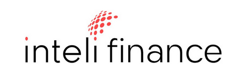

# Proposta de Gestão de Feedback e Desenvolvimento Pessoal - InteliFinance

## Sumário

[1. Problema](#c1)

[2. Solução](#c2)

[3. Game Design](#c3)

[4. Desenvolvimento do jogo](#c4)

[5. Casos de Teste](#c5)

[6. Conclusões e trabalhos futuros](#c6)

[7. Referências](#c7)

[Anexos](#c8)

## 1. Mercado

&nbsp;&nbsp;&nbsp;&nbsp;O atual cenário organizacional está se tornando cada vez mais competitivo, o que demanda das organizações uma atenção ainda maior aos seus colaboradores. Isso inclui investir em comunicação eficiente entre líderes e liderados, bem como proporcionar um contínuo aprimoramento e desenvolvimento profissional para ambas as partes.

&nbsp;&nbsp;&nbsp;&nbsp;O uso do feedback e de avaliações de desempenho é essencial para manter boas relações dentro das empresas. Essas ferramentas são fundamentais para aprimorar relacionamentos, satisfação e performance dos funcionários. O feedback oferece comunicação aberta e construtiva, orientando sobre pontos fortes e áreas de melhoria. Já as avaliações de desempenho estabelecem metas claras, incentivam o crescimento profissional e permitem identificar oportunidades de capacitação e reconhecimento. Ao adotar essa cultura organizacional, as empresas fortalecem laços internos e cultivam um ambiente propício ao crescimento coletivo e à excelência.

## 2. Problema

## 3. Solução

## 4. Objetivos

## 5. Responsáveis e Linha de Produção

## 6. Sistema de recompensa e reconhecimento

## 7. Referêncial bibliográfico

&nbsp;&nbsp;&nbsp;&nbsp;Internacionalmente reconhecida, a FMUSP continua a liderar o caminho em pesquisas de vanguarda, abrangendo áreas como cirurgia com células-tronco, desenvolvimento de pele artificial e outras tendências futuras na medicina.

¹⁴ HAIDER, Arwa. The music most embedded in our psyches? Disponível em: https://www.bbc.com/culture/article/20220608-the-music-most-embedded-in-our-psyches. Acesso em 13 mar. 2024. 
